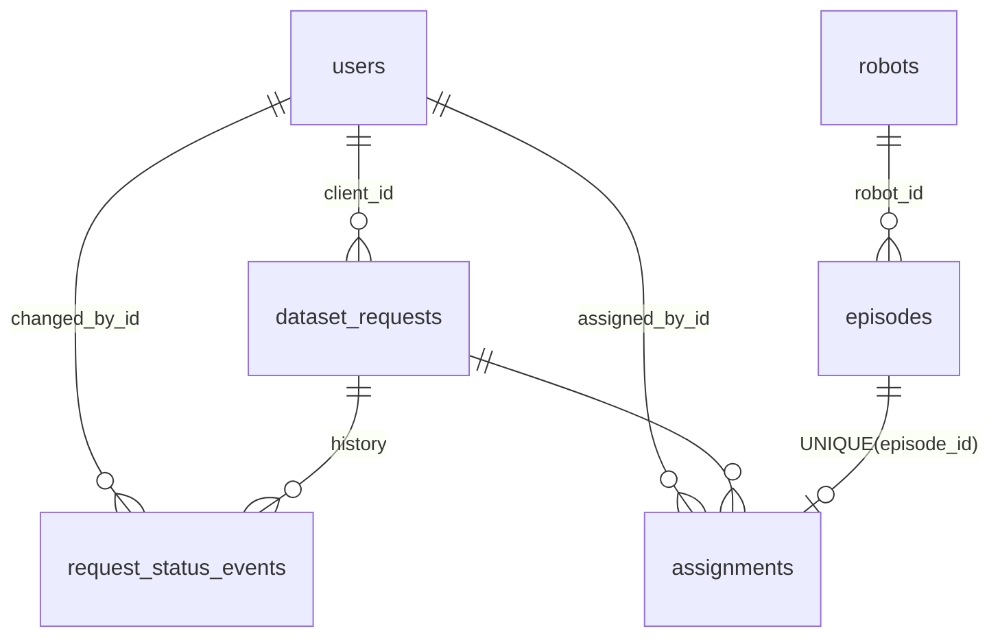

# Notes

## 1. Design

### Data model

- **users**: role (`client` / `operator` / `admin`), Argon2id hash, `is_active`.
  Emails are unique case-insensitively via a unique index on `lower(email)`.
- **robots**: reference table seeded by a migration. `episodes.robot_id` is a foreign key,
  so an unknown robot can't be stored even by a buggy code path.
- **episodes**: `episode_id` (the recording system's id) is a unique natural key and the
  basis of import idempotency; `id` is a BIGINT surrogate key. CHECKs on quality and
  `duration_seconds > 0`.
- **dataset_requests**: current `status` stored on the row for cheap filtering.
- **request_status_events**: append-only audit log (from, to, who, when, optional note).
  The creation event is `NULL -> submitted`.
- **assignments**: `UNIQUE(episode_id)` is what actually guarantees "one request per
  episode". Unassigning deletes the row.

**Where state lives:** everything durable is in PostgreSQL. The API is stateless (JWT in
an HttpOnly cookie), so it can scale horizontally. The frontend keeps no state beyond
what is on screen; the server's `allowed_transitions` field drives which buttons exist.

### Decisions I found hardest

1. **Where to enforce the domain rules.** I enforce each rule in the service layer (for
   clear error messages) *and* in the database where it can be expressed: a UNIQUE
   constraint for one-request-per-episode, a foreign key for known robots, and CHECKs for
   enums and positive numbers. Status changes and assignments lock the request row
   (`SELECT ... FOR UPDATE`), so "enough episodes to deliver" can't race with an unassign.
   `test_concurrency.py` runs two real threads assigning the same episode: exactly one wins.
2. **Modelling the workflow.** The state machine is one table,
   `{(from, to): roles_allowed}` in `services/workflow.py`. Validation, the UI's buttons
   (`allowed_transitions`) and an exhaustive test of all 75 `(from, to, role)` combinations
   all read the same table. Admins can do operator steps but not client steps: accepting a
   delivery on a client's behalf would defeat the point of the client's sign-off.
3. **What "safe to re-run" means for the import.** The import is insert-only:
   `INSERT ... ON CONFLICT (episode_id) DO NOTHING RETURNING`. Existing episodes are
   reported as `already_imported` and never overwritten, because an episode may already
   be assigned and delivered, and silently changing its quality would be worse than
   ignoring an update. Corrections would be a separate, explicit operation.

### Import rules (seed data decisions)

| Case | Decision |
|---|---|
| `episode_id` casing/whitespace | trimmed and upper-cased (`ep-00003` = `EP-00003`) |
| duplicate id in the same file | first occurrence kept; the report says whether the later copy was identical or conflicting (e.g. EP-00011 `bad` vs `good`) |
| robot not in `robots` (`arm-99`, blank) | rejected |
| task name casing/spacing | whitespace collapsed, lower-cased (`  Pick Cup ` → `pick cup`) |
| dates | ISO with/without `T`, with `Z`; `DD/MM/YYYY HH:MM` is day-first (the file contains `14/08/2026`, which only parses day-first); naive times treated as UTC; `not a date` rejected |
| recorded in the future (EP-00025, `2031-01-01`) | rejected, with one day of tolerance for clock skew between systems |
| duration | positive whole seconds only: `45.5`, `-5`, `N/A`, blank rejected rather than guessed |
| quality | case-insensitive `good/usable/bad`; `excellent`, blank rejected |
| missing operator name | allowed (stored as NULL); it isn't needed for any rule |
| blank / malformed row | reported with its line number |

Result on the seed file: 190 rows → 173 imported, 17 skipped; a second run imports 0.

Other ambiguities I resolved:
- A request's task name is normalised like an episode's, so filters match.
- Deadlines can't be in the past.
- Assignments can only change while the request is `in_progress`.
- An assignment batch is all-or-nothing.
- Episode task names are not forced to match the request's task. The UI pre-filters by it,
  but an operator can deliberately use a close match.
- Analytics days are bucketed in UTC. Fulfilment covers requests *created* in the range,
  and time-to-deliver uses each request's **first** delivery, so rework doesn't inflate
  the median.

## 2. Left out / simplified, and the next two days

- **No stretch item.** I prioritised correctness and tests. Next I would add SSE for live
  request updates: a Postgres `LISTEN/NOTIFY` on status events fanned out to operators.
- **Login throttling is per process.** Failed logins are limited in memory (see Security). With several replicas it should move to Redis.
- **No token revocation.** Logout clears the cookie, but a stolen token stays valid until
  it expires (60 min). Deactivation *is* immediate, because every request loads the user.
  Next: short-lived access token plus rotating refresh token, or server-side sessions.
- **Offset pagination and exact `count(*)`.** Fine at this size; see Scale.
- **Frontend tests.** The UI was verified end to end with scripted browser runs (a full
  client/operator lifecycle including rejection and rework), but those scripts aren't in
  the repo. I'd add Playwright tests to CI for the two main flows.
- Also not done: editing or cancelling a request, email notifications, CSV export,
  per-user timezone for analytics.

## 3. Something that went wrong

**The case-insensitive email index indexed a constant.** I declared it with
`Index(..., func.lower("email"))`. Reading the auto-generated migration before applying
it, I saw `lower('email')`: SQLAlchemy had treated `"email"` as a string literal, so every
row would get the same index value. The second user ever created would have failed with a
unique violation, and case-insensitive uniqueness was never actually enforced. The
fix was `text("lower(email)")`. I added a test that inserts `A@X.COM` after `a@x.com`
*bypassing the service layer*, to prove the database itself refuses it. Lesson: always
read autogenerated migrations, and test constraints at the database level, not only
through the code that normally guards them.

Two smaller ones:
- **Logging crash.** The first seed run crashed while logging `extra={"created": ...}`,
  because `created` is a reserved `LogRecord` attribute. The users had already been
  committed, so re-running reported 0 created and 5 skipped. The idempotency held, but it
  was a reminder that logging must never take down the operation.
- **Text ids compare as text.** Cleaning load-test data with
  `DELETE ... WHERE episode_id >= 'EP-100000'` also deleted `EP-90001`, because
  `'EP-9' > 'EP-1'` as strings. I noticed when a re-import brought back 3 rows. The ids
  are opaque strings, so any range logic must parse them.

## 4. Security

- **Passwords:** Argon2id (`argon2-cffi` defaults). Login always runs one hash check,
  against a dummy hash for unknown emails, so response time doesn't reveal whether an
  account exists; the error message is identical too. Seed passwords are hashed on insert.
- **Tokens:** HS256 JWT with the algorithm pinned on decode (rejects `alg: none`),
  `exp` required, 60-minute lifetime. Stored in an `HttpOnly`, `SameSite=Lax` cookie
  (`Secure` by default, disabled only for plain-HTTP localhost), so JavaScript can't read
  it. The frontend proxies `/api/*` to the backend, so the browser talks to one origin and
  CORS stays narrow. The app refuses to start with the default secret when
  `APP_ENV=production`.
- **Authorization:** always on the server, in FastAPI dependencies (role guards) and in
  the services (ownership). Requests another client owns return **404, not 403**, so ids
  can't be probed. Deactivated users are rejected on their next request.
- **Input validation:** Pydantic models with length and range limits; enums validated;
  the ORM parameterises all SQL; CSV upload capped at 50 MB and streamed, not loaded into
  memory; unhandled errors return a generic 500 with a request id, never a stack trace.
- **Hardening:** security headers (`nosniff`, `X-Frame-Options: DENY`, referrer and
  permissions policies), no `X-Powered-By`, containers run as non-root users.

**The two vulnerabilities I'd worry about most:**
1. **Broken object-level authorization (IDOR).** One missing ownership filter would leak
   a client's requests or deliveries to a competitor. That's why visibility is enforced in
   a single function (`get_request` / `_visible_to`) that every read and write goes
   through, and why there are tests for cross-client reads, transitions and assignment
   views.
2. **Credential attacks on login.** Seed-style weak passwords exist. Failed logins are
   now throttled: 5 failures per (IP, email) within 5 minutes returns `429` with
   `Retry-After`, and a successful login resets the count. The limits are that the state
   lives in one process, and behind the Next.js proxy the IP is the proxy's, so in
   practice it's per account. Next: move it to Redis, trust `X-Forwarded-For` from the
   proxy only, enforce a stronger password policy (new users need 8+ characters), and
   alert on repeated failures.

Also on the list: CSRF if a non-`Lax` cookie or a GET with side effects is ever
introduced, and CSV/formula injection if exports are added.

## 5. Scale

I measured against 200,000 generated episodes on a laptop-class machine:
- **Import:** about 13k rows/s. It was about 6k rows/s at first; the bottleneck was
  SQLAlchemy compiling one huge multi-row `VALUES` statement per batch, and switching to
  executemany with `insertmanyvalues` halved the time.
- **Analytics:** 1 month takes about 70 ms and 1 year about 170 ms. `EXPLAIN` shows index
  range scans on `(recorded_at, robot_id)` and on the partial index
  `(recorded_at, task_name) WHERE quality = 'good'`.

**10× users.** The API is stateless, so add workers and replicas behind a load balancer.
What breaks first:
- **Login CPU.** Argon2 is slow on purpose, and it's the first thing a login rush
  saturates, so size workers for it and rate-limit.
- **Database connections.** Put PgBouncer in front of Postgres.
- **List endpoints.** Offset pagination and exact `count(*)` degrade; switch to keyset
  pagination on `(created_at, id)`.

**100× episodes (~17M+ rows), including the brief's 5 million.** Every analytics query is
a single range scan over an index, so cost grows with the size of the date range, not the
table. At 5 million episodes a one-month query still touches only that month's slice.
Year-long ranges and the per-day grouping become the slow part (millions of index
entries). Changes, in order:
1. **Daily rollup table** `(day, robot_id, task_name, quality, count)`. The import is the
   only writer, so it can update the rollup in the same transaction. Analytics then reads
   hundreds of rows instead of millions.
2. **Partition `episodes` by month** on `recorded_at`, or add a BRIN index, since data
   arrives roughly in time order.
3. **Import:** use `COPY` into an unlogged staging table, then one
   `INSERT ... SELECT ... ON CONFLICT DO NOTHING`. Detecting in-file duplicates moves into
   SQL too; today it keeps one hash per id in memory.
4. **Episode picker:** show "N+" instead of an exact total, and add a partial index for
   unassigned good/usable episodes if that query becomes hot.

## 6. AI tooling

I used an AI coding assistant during development: to talk through the design, to write
first drafts of code and tests, and to review. I checked every change by running it:
backend tests against Postgres, lint and type checks, and manual runs of the UI and of
`docker compose up`. I rejected or rewrote suggestions that didn't fit, and I understand
and can explain every line in this repository.
